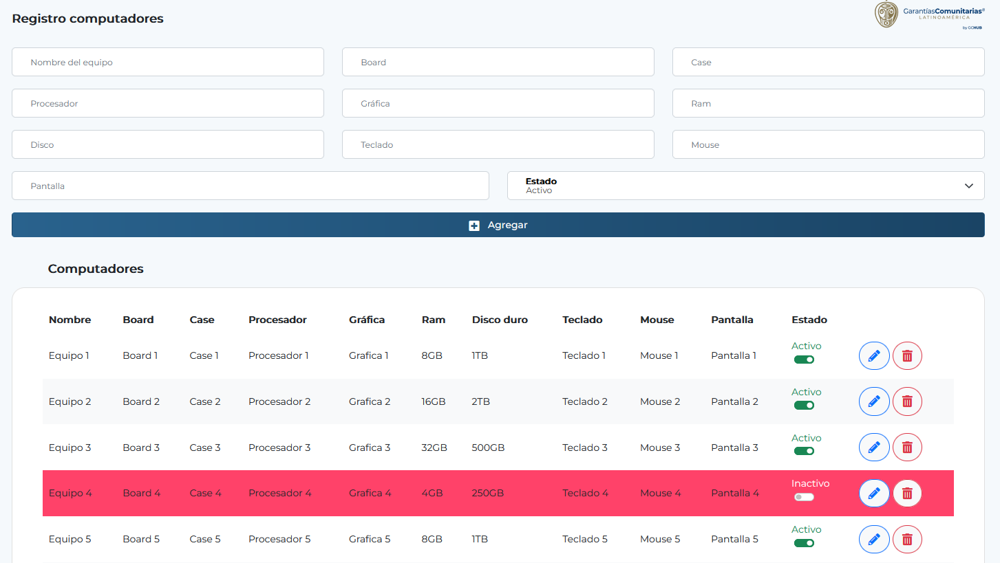

# 🚀 Proyecto Prueba2023: Actualización Exitosa 🎉

## 📑 Resumen

¡El proceso fue todo un éxito y seguimos las indicaciones al pie de la letra! 🌟

## ✅ Pasos Realizados

Aquí está la aventura que vivimos en nuestro último despliegue:

1. 📦 Instalamos las dependencias con la precisión de un relojero.
2. 🐙 Clonamos el repositorio de GitHub con la delicadeza de un cirujano.
3. 🔨 Realizamos cambios en el código como un artista con su pincel.
4. 🧪 Ejecutamos las pruebas como un científico loco en su laboratorio.
5. 🆕 Creamos una nueva versión del proyecto, ¡casi como estrenar traje nuevo!

## 📸 Imágenes del Progreso

¡Echa un vistazo a los cambios mágicos!

---

¡Gracias por visitar nuestro repositorio! Si te gusta lo que hacemos, no olvides dejar una ⭐ en GitHub.

Si tienes preguntas o quieres unirte a nuestra tripulación de piratas del código,
¡envía un mensaje en una botella! 📬 o abre un 'issue' en el repositorio.

¡Hasta la próxima aventura! 🌈
